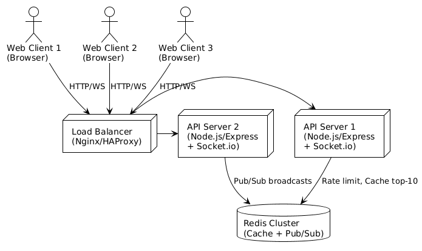
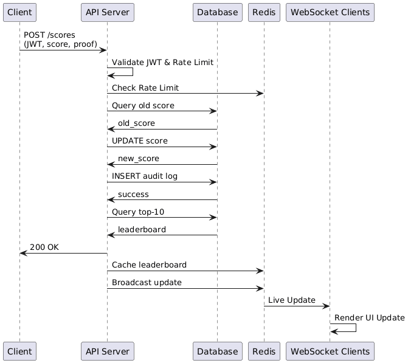

# Live Scoreboard Update Module - Software Requirements Specification

## 1. Introduction

### 1.1 Purpose
This document outlines the requirements for a Live Scoreboard Update Module that manages secure score updates from user actions and provides real-time top-10 leaderboard updates to connected clients.

### 1.2 Scope
The module includes:
- Secure score submission API with user authentication
- Real-time leaderboard updates through WebSocket connections
- Protection against cheating and unauthorized score changes
- Top-10 user ranking display system

### 1.3 Definitions and Acronyms
- **API**: Application Programming Interface
- **JWT**: JSON Web Token
- **HMAC**: Hash-based Message Authentication Code
- **WebSocket**: Full-duplex communication protocol
- **SRS**: Software Requirements Specification

## 2. Overall Description

### 2.1 Product Perspective
The Live Scoreboard Update Module works as a backend service that connects with:
- Frontend web application showing the scoreboard
- User authentication system
- Database for storing user data
- Real-time communication system

### 2.2 Product Functions
- **F1**: Check user identity for score update requests
- **F2**: Validate and handle score increases
- **F3**: Keep track of top-10 leaderboard rankings
- **F4**: Send real-time updates to connected clients
- **F5**: Block unauthorized score changes
- **F6**: Record all score changes for tracking

### 2.3 User Classes and Characteristics
- **End Users**: Players who complete game actions and get score updates
- **System Administrators**: People who monitor and maintain the scoring system
- **Frontend Applications**: Programs that use API and WebSocket services

### 2.4 Operating Environment
- **Server Platform**: Node.js runtime environment
- **Web Framework**: Express.js
- **Real-time Communication**: Socket.io
- **Authentication**: JWT-based token system
- **Storage**: Database system with caching layer

## 3. System Features

### 3.1 Score Update API (F1, F2)

#### 3.1.1 Description
REST API endpoint that receives authenticated score update requests from users who have completed actions.

#### 3.1.2 Functional Requirements
- **REQ-001**: System must check all score update requests using JWT tokens
- **REQ-002**: System must verify that new scores are higher than current scores
- **REQ-003**: System must confirm action completion proof using HMAC validation
- **REQ-004**: System must update user scores safely to avoid conflicts
- **REQ-005**: System must record all score changes with timestamp and proof hash

#### 3.1.3 Input/Output Specifications

**Input Format:**
```json
POST /api/scores
Authorization: Bearer <JWT_TOKEN>
Content-Type: application/json

{
  "new_score": 1500,
  "action_proof": "hmac_hash_of_action_completion",
  "action_type": "level_complete",
  "timestamp": "2026-02-04T10:30:00Z"
}
```

**Output Format:**
```json
{
  "success": true,
  "data": {
    "user_id": "uuid",
    "old_score": 1200,
    "new_score": 1500,
    "rank": 5,
    "rank_change": 2
  }
}
```

### 3.2 Real-time Leaderboard Broadcasting (F3, F4)

#### 3.2.1 Description
WebSocket service that keeps connections with clients and sends top-10 leaderboard updates immediately.

#### 3.2.2 Functional Requirements
- **REQ-006**: System must maintain ongoing WebSocket connections with clients
- **REQ-007**: System must send top-10 leaderboard updates right after score changes
- **REQ-008**: System must send current leaderboard to new clients when they connect
- **REQ-009**: System must handle client disconnections properly

#### 3.2.3 WebSocket Event Specifications
**Outbound Events:**
```json
// Leaderboard update
{
  "type": "leaderboard_update",
  "data": {
    "top10": [
      {"user_id": "uuid", "username": "player1", "score": 2500},
      {"user_id": "uuid", "username": "player2", "score": 2300}
    ],
    "timestamp": "2026-02-04T10:30:00Z"
  }
}

// Individual score update
{
  "type": "score_update",
  "data": {
    "user_id": "uuid",
    "old_score": 1200,
    "new_score": 1500,
    "rank_change": 2
  }
}
```

### 3.3 Anti-Cheat Protection (F5)

#### 3.3.1 Description
Security features to prevent unauthorized score changes and ensure fair gameplay.

#### 3.3.2 Functional Requirements
- **REQ-010**: System must limit users to 5 score updates per minute
- **REQ-011**: System must reject attempts to decrease scores
- **REQ-012**: System must validate action proof using HMAC with server-side secret
- **REQ-013**: System must detect and mark suspicious score patterns
- **REQ-014**: System must require HTTPS/TLS for all communications

### 3.4 Audit Logging (F6)

#### 3.4.1 Description
Complete logging system for tracking all score-related activities.

#### 3.4.2 Functional Requirements
- **REQ-015**: System must log all score update attempts with user information
- **REQ-016**: System must record timestamps, IP addresses, and user agents
- **REQ-017**: System must store action proof hashes for checking
- **REQ-018**: System must keep audit trail for security review

## 4. Non-Functional Requirements

### 4.1 Performance Requirements
- **PERF-001**: API must respond to score updates within 200ms under normal load
- **PERF-002**: WebSocket broadcasts must reach all connected clients within 100ms
- **PERF-003**: System must support 1000+ concurrent WebSocket connections
- **PERF-004**: Leaderboard queries must complete within 50ms

### 4.2 Security Requirements
- **SEC-001**: All API endpoints must require valid JWT authentication
- **SEC-002**: JWT tokens must have maximum lifetime of 1 hour
- **SEC-003**: Action proofs must use HMAC-SHA256 with server-side secret
- **SEC-004**: Rate limiting must be applied per user with Redis storage
- **SEC-005**: All communications must use HTTPS/TLS encryption

### 4.3 Reliability Requirements
- **REL-001**: System must maintain 99.9% uptime during peak hours
- **REL-002**: Score updates must be atomic and consistent
- **REL-003**: System must recover properly from database connection failures
- **REL-004**: WebSocket connections must auto-reconnect on network interruption

### 4.4 Scalability Requirements
- **SCALE-001**: System must support horizontal scaling across multiple server instances
- **SCALE-002**: Leaderboard cache must be shared across all instances
- **SCALE-003**: System must handle 10,000+ registered users
- **SCALE-004**: WebSocket broadcasts must work across multiple servers

## 5. System Architecture

### 5.1 High-Level Architecture



### 5.2 Component Interaction Flow



## 6. Error Handling

### 6.1 HTTP Error Codes

| Status Code | Error Type | Description | Response Format |
|-------------|------------|-------------|-----------------|
| 400 | Bad Request | Invalid request format or parameters | `{"error": "message", "code": "INVALID_REQUEST"}` |
| 401 | Unauthorized | Invalid or missing JWT token | `{"error": "message", "code": "AUTH_REQUIRED"}` |
| 409 | Conflict | Score decrease attempt | `{"error": "message", "code": "INVALID_SCORE"}` |
| 422 | Unprocessable Entity | Invalid action proof | `{"error": "message", "code": "INVALID_PROOF"}` |
| 429 | Too Many Requests | Rate limit exceeded | `{"error": "message", "code": "RATE_LIMIT", "retry_after": 60}` |
| 500 | Internal Server Error | System error | `{"error": "message", "code": "SYSTEM_ERROR"}` |

### 6.2 WebSocket Error Handling
- Connection failures: Automatic reconnection with exponential backoff
- Invalid events: Error message sent to client
- Authentication failures: Connection termination with error code

---

*This Software Requirements Specification provides complete requirements for building a secure, scalable, and real-time scoreboard system. All requirements should be checked through proper testing before production deployment.*